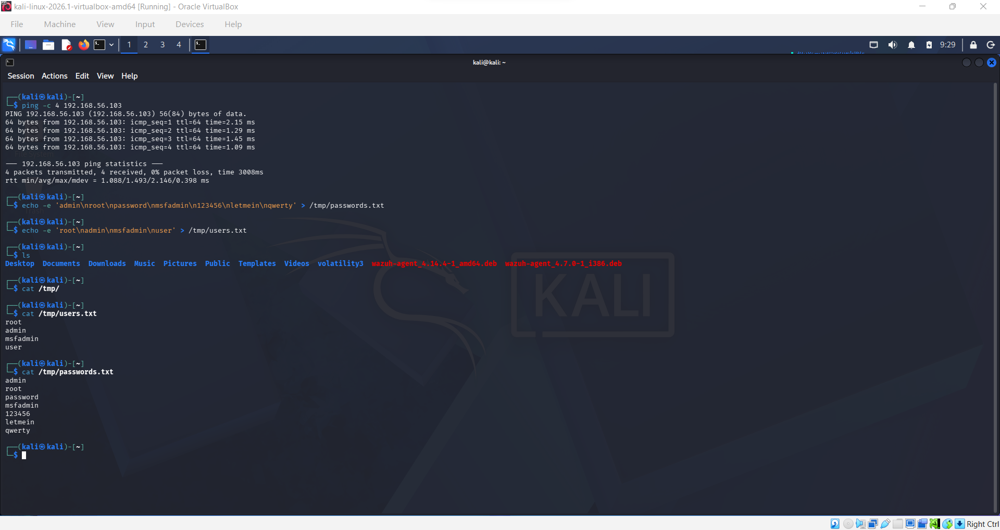
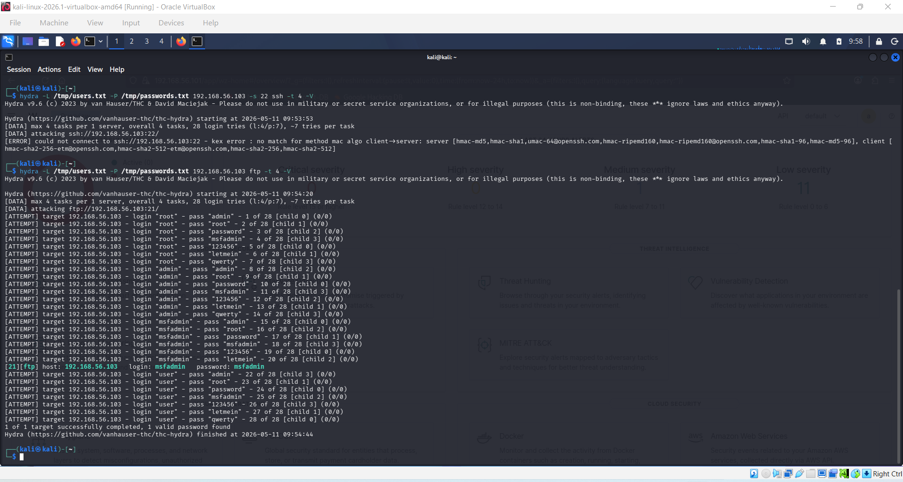
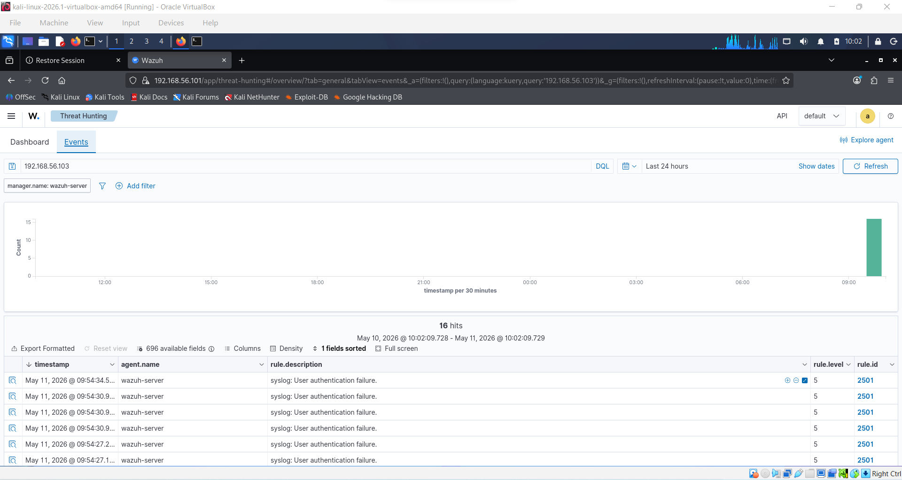
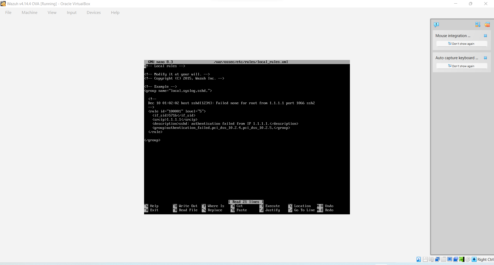
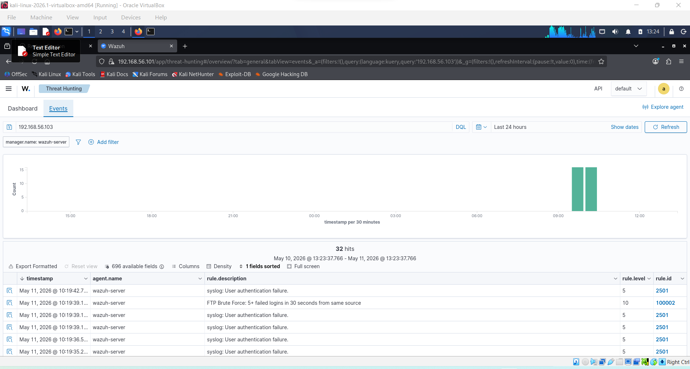
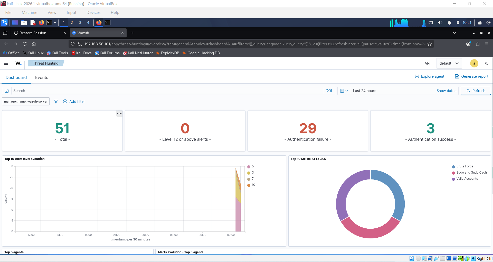
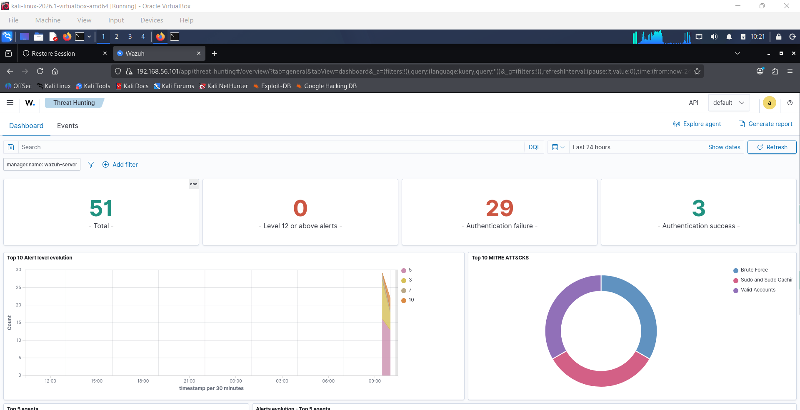

# Project 2 – FTP Brute Force Attack: Detection & Custom Rule Writing

## Objective

This project demonstrates how a brute force attack against FTP can be executed using Hydra, detected by a SIEM (Wazuh), and how a custom detection rule can be written to generate high-severity alerts when multiple failed login attempts occur within a short timeframe.

## Attack Summary

- Attack Type: FTP Credential Brute Force
- Tool Used: Hydra
- Target Service: FTP (Port 21)
- Credentials Found: msfadmin:msfadmin
- Total Attempts: 28
- Detection: Wazuh Rule 2501 + Custom Rule 100002
- MITRE ATT&CK Tactic: Credential Access — T1110 Brute Force

## Tools Used

- Kali Linux (Attacker)
- Metasploitable2 (Vulnerable Target)
- Hydra (Brute Force Tool)
- Wazuh SIEM (Defender)

## Lab Environment

|Machine        |IP Address    |Role           |
|---------------|--------------|---------------|
|Kali Linux     |192.168.56.102|Attacker       |
|Metasploitable2|192.168.56.103|Target         |
|Wazuh          |192.168.56.105|SIEM / Defender|

## Step 1: Create Wordlists

Create username and password files that Hydra will use for the attack:
echo -e 'admin\nroot\npassword\nmsfadmin\n123456\nletmein\nqwerty' > /tmp/passwords.txt
echo -e 'root\nadmin\nmsfadmin\nuser' > /tmp/users.txt

Verify they were created correctly:
cat /tmp/users.txt
cat /tmp/passwords.txt

What each file contains:

- users.txt — 4 usernames to try
- passwords.txt — 7 passwords to try
- Total combinations: 28 attempts

## Step 2: Run the Brute Force Attack

Launch Hydra against FTP on Metasploitable2:
hydra -L /tmp/users.txt -P /tmp/passwords.txt 192.168.56.103 ftp -t 4 -V

Command breakdown:

- -L /tmp/users.txt — use file for usernames
- -P /tmp/passwords.txt — use file for passwords
- 192.168.56.103 — target IP
- ftp — protocol to attack
- -t 4 — 4 parallel threads
- -V — verbose, show every attempt

Result:
[21][ftp] host: 192.168.56.103 login: msfadmin password: msfadmin
1 of 1 target successfully completed, 1 valid password found

Hydra successfully cracked the credentials after 20 attempts.

## Step 3: Check Initial Wazuh Detection

Before writing a custom rule, check what Wazuh detected from the attack.

Navigate to Security Events in Wazuh and filter by 192.168.56.103.

Wazuh detected 16 events — all Rule 2501:

|Rule ID|Description                        |Level  |
|-------|-----------------------------------|-------|
|2501   |syslog: User authentication failure|5 (Low)|

Key observation: Wazuh detected each individual failure but did not raise a high severity alert for the brute force pattern. This is the detection gap we will fix with a custom rule.

## Step 4: Write a Custom Brute Force Detection Rule

On the Wazuh VM, open the local rules file:
sudo nano /var/ossec/etc/rules/local_rules.xml

Add this custom rule inside the <group> tags:
<rule id="100002" level="10" frequency="5" timeframe="30">
  <if_matched_sid>2501</if_matched_sid>
  <description>FTP Brute Force: 5+ failed logins in 30 seconds from same source</description>
  <mitre>
    <id>T1110</id>
  </mitre>
</rule>

What each part means:

|Tag             |Value |Meaning                                      |
|----------------|------|---------------------------------------------|
|`id`            |100002|Unique rule ID (custom rules start at 100000)|
|`level`         |10    |High severity alert                          |
|`frequency`     |5     |Fires after 5 matching events                |
|`timeframe`     |30    |Within a 30-second window                    |
|`if_matched_sid`|2501  |Watches for Rule 2501 (auth failure)         |
|`mitre id`      |T1110 |MITRE Brute Force technique                  |

Save with Ctrl+O → Enter, exit with Ctrl+X.

## Step 5: Restart Wazuh and Test

Restart Wazuh to load the new rule:
sudo systemctl restart wazuh-manager

Run Hydra again from Kali to trigger the rule:
hydra -L /tmp/users.txt -P /tmp/passwords.txt 192.168.56.103 ftp -t 4 -V

## Step 6: Verify Custom Rule Fired

Navigate to Security Events in Wazuh and filter by 192.168.56.103.

Results — 32 total hits:

|Rule ID   |Description                                        |Level        |
|----------|---------------------------------------------------|-------------|
|2501      |syslog: User authentication failure                |5 (Low)      |
|**100002**|**FTP Brute Force: 5+ failed logins in 30 seconds**|**10 (High)**|

Custom Rule 100002 fired multiple times — once every 5 failed attempts within 30 seconds.

## Step 7: Check Threat Hunting Dashboard

Navigate to Threat Hunting in Wazuh to see the full picture:

- 51 total alerts
- 29 authentication failures
- 3 authentication successes (valid credentials found)
- MITRE ATT&CK: Brute Force technique detected

## Step 8: MITRE ATT&CK Mapping

|Technique ID|Name             |Evidence                                      |
|------------|-----------------|----------------------------------------------|
|T1110       |Brute Force      |29 authentication failures in rapid succession|
|T1110.001   |Password Guessing|Hydra trying wordlist combinations            |
|T1078       |Valid Accounts   |Successful login after cracking credentials   |

## Detection Analysis

Before custom rule:

- Wazuh detected individual failures at level 5 (Low)
- No alert for the brute force pattern itself
- SOC analyst would need to manually correlate failures

After custom rule:

- Rule 100002 fires at level 10 (High) after 5 failures in 30 seconds
- Pattern is automatically detected — no manual correlation needed
- MITRE T1110 automatically tagged on the alert

Key Detection Insight:
The difference between a brute force attack and a user forgetting their password is volume and velocity. One or two failures = user error. Five failures in 30 seconds from the same source = brute force. The custom rule captures this pattern precisely.

## Incident Response Perspective

Triage:

- Rule 100002 fires — FTP brute force detected from 192.168.56.102
- Check source IP — is it internal or external?
- Check if authentication succeeded after the failures

Investigation:

- Review all authentication events from the source IP
- Check if the attacker logged in successfully after brute forcing
- Identify what actions were taken after successful login

Containment:

- Block source IP at the firewall
- Reset compromised credentials immediately
- Disable FTP if not required — replace with SFTP

Eradication:

- Remove FTP service or upgrade to SFTP
- Implement account lockout after 3-5 failed attempts
- Add MFA to all remote access services

## Key Points to Note

- FTP transmits credentials in cleartext — even without brute forcing, credentials can be sniffed on the network
- Hydra supports 50+ protocols — the same attack works against SSH, RDP, HTTP login pages, databases
- The custom rule fires at level 10 — in a real SOC this would page an analyst immediately
- Authentication successes after multiple failures is a high-confidence indicator of successful brute force

## Preventive Measures

- Implement account lockout after 3-5 failed login attempts
- Replace FTP with SFTP (SSH File Transfer Protocol)
- Use strong, unique passwords — wordlist attacks fail against complex credentials
- Implement Multi-Factor Authentication (MFA)
- Restrict FTP/SFTP access by IP whitelist
- Monitor for authentication failures in real time using SIEM rules

## Custom Rule — Summary
<rule id="100002" level="10" frequency="5" timeframe="30">
  <if_matched_sid>2501</if_matched_sid>
  <description>FTP Brute Force: 5+ failed logins in 30 seconds from same source</description>
  <mitre>
    <id>T1110</id>
  </mitre>
</rule>

This rule demonstrates detection engineering — writing logic that identifies attack patterns rather than just individual events. It can be adapted for SSH (sid: 5716), HTTP (sid: 31101), and other protocols by changing the if_matched_sid value.

## MITRE ATT&CK Techniques

|Technique ID|Name             |
|------------|-----------------|
|T1110       |Brute Force      |
|T1110.001   |Password Guessing|
|T1078       |Valid Accounts   |
|T1021       |Remote Services  |

## Conclusion

This project demonstrated a complete brute force attack lifecycle — from wordlist creation and credential cracking to SIEM detection and custom rule writing.

The most important takeaway is the detection gap that exists without custom rules. Wazuh’s default rules detect individual authentication failures but don’t automatically recognize the brute force pattern. Writing Rule 100002 closed that gap by correlating multiple events into a single high-severity alert.

This is detection engineering in practice — understanding how attacks work, identifying what evidence they leave behind, and writing rules that turn that evidence into actionable alerts. 
